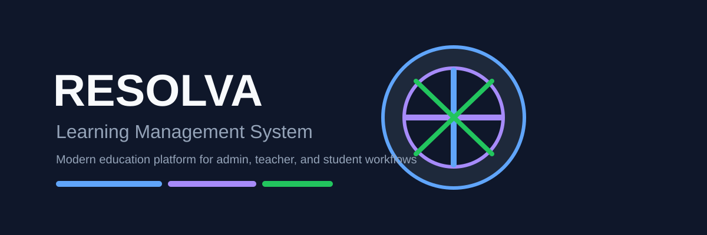
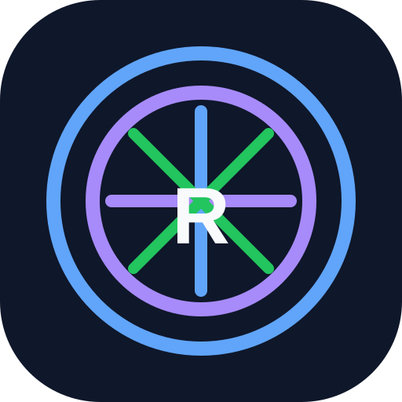

# Resolva LMS

<div align="center">
  
</div>

<div align="center">
  
  
  
  
</div>

<p align="center">
  
  <br>
  <strong>Learning Management System modern berbasis Laravel</strong><br>
  Menghubungkan admin, guru, dan siswa dalam satu ekosistem pembelajaran digital yang terstruktur.
</p>

## Overview

Resolva LMS adalah platform pembelajaran digital yang dirancang untuk kebutuhan institusi pendidikan, mulai dari kelas, materi, tugas, kuis, hingga proses penilaian berbasis proyek. Sistem ini dibuat untuk memudahkan pengelolaan proses belajar mengajar dengan mekanisme akses berbasis peran.

### Peran utama

- Admin: mengelola pengguna, kelas, dan pengaturan sistem
- Guru / Dosen: membuat materi, tugas, kuis, serta menilai siswa
- Siswa / Mahasiswa: mengikuti kelas, mengakses materi, mengerjakan tugas, dan mengikuti evaluasi

## Why this project

Proyek ini dibuat untuk menjawab kebutuhan pendidikan digital yang tidak hanya fokus pada delivery materi, tetapi juga pada interaksi, evaluasi, progress, dan pengelolaan kelas secara terintegrasi.

Beberapa alasan utama proyek ini dibuat:

- Sistem pembelajaran yang mudah dikelola oleh admin
- Guru memiliki kontrol penuh terhadap kelas dan penilaian
- Siswa dapat mengakses materi dan progress belajar secara jelas
- Workflow akademik lebih terstruktur dengan role-based access

## Fitur utama

<div align="center">

| Fitur | Deskripsi |
| --- | --- |
| Manajemen Role | Admin, guru, dan siswa dengan akses yang berbeda |
| Kelas & Mata Pelajaran | Pengelolaan kelas dan pemetaan mata pelajaran |
| Materi Pembelajaran | Upload, kelola, dan tampilkan materi pembelajaran |
| Diskusi Kelas | Forum komunikasi antar siswa dan guru |
| Kuis & Evaluasi | Pembuatan soal, pengerjaan, dan hasil evaluasi |
| PBL / Problem Based Learning | Pembelajaran berbasis proyek dan validasi tahap |
| Penilaian & Feedback | Guru memberikan feedback serta rekap nilai |
| Import Data | Import pengguna dan soal dalam format tertentu |
| Java Support | Dukungan eksekusi program Java untuk tugas teknis |

</div>

## Default akun seed

Akun default dibuat melalui seeder di [database/seeders/GuruKelasSeeder.php](database/seeders/GuruKelasSeeder.php):

| Role | Nama | Email | Password |
| --- | --- | --- | --- |
| Admin | Admin Contoh | admin@example.com | password |
| Guru | Guru Contoh | guru@example.com | password |
| Siswa | Siswa Contoh | siswa@example.com | password |

> Semua akun default menggunakan password `password`.

## Stack teknologi

- Laravel 12
- PHP 8.2
- MySQL / database relasional
- Blade templating engine
- Tailwind CSS
- Vite
- Composer & npm

## Quick start

### 1. Clone repository

```bash
git clone https://github.com/username/nama-repo.git
cd nama-repo
```

### 2. Install dependency PHP

```bash
composer install
```

### 3. Setup environment

```bash
cp .env.example .env
php artisan key:generate
```

Konfigurasikan database di file `.env`:

```env
DB_CONNECTION=mysql
DB_HOST=127.0.0.1
DB_PORT=3306
DB_DATABASE=laravellms
DB_USERNAME=root
DB_PASSWORD=
```

### 4. Jalankan migrasi dan seed data

```bash
php artisan migrate --seed
```

### 5. Install frontend dependency

```bash
npm install
npm run dev
```

### 6. Jalankan aplikasi

```bash
php artisan serve
```

Akses aplikasi di:

```text
http://localhost:8000
```

## Struktur proyek

```text
.
├── app/
│   ├── Console/
│   ├── Helpers/
│   ├── Http/
│   ├── Imports/
│   ├── Models/
│   ├── Policies/
│   └── Providers/
├── bootstrap/
├── config/
├── database/
│   ├── factories/
│   ├── migrations/
│   ├── schema/
│   └── seeders/
├── docs/
│   └── java-compiler.md
├── public/
├── resources/
│   ├── css/
│   ├── js/
│   └── views/
├── routes/
├── scripts/
├── storage/
├── tests/
├── artisan
├── composer.json
├── package.json
├── phpunit.xml
├── README.md
├── vite.config.js
├── tailwind.config.js
├── .env.example
├── .gitignore
├── .gitattributes
├── .editorconfig
└── .env
```

## Dokumentasi proyek

Dokumen pendukung yang tersedia di repositori ini:

- [docs/java-compiler.md](docs/java-compiler.md) — dokumentasi compiler Java dan eksekusi program
- [resolution_notes.md](resolution_notes.md) — catatan teknis dan keputusan implementasi proyek

## Menjalankan test

```bash
php artisan test
```

## Catatan keamanan

- Jangan pernah mempublikasikan file `.env` ke GitHub
- Gunakan password yang kuat untuk environment production
- Hindari menyimpan secret, token, atau hasil upload sensitif di repository

## Roadmap

- Penambahan dashboard analytics untuk admin dan guru
- Integrasi notifikasi email dan reminder tugas
- Peningkatan export laporan nilai
- Penyempurnaan UX pada aktivitas pembelajaran
- Integrasi modul pembelajaran lebih lanjut sesuai kebutuhan institusi

## Kontribusi

Kontribusi sangat diterima. Langkah umum:

1. Fork repository
2. Buat branch baru
3. Lakukan perubahan
4. Commit dan push
5. Buat pull request

## Lisensi

Proyek ini dilisensikan di bawah lisensi MIT.

---

<p align="center">
  <sub>Built with Laravel • Crafted for modern learning experiences</sub>
</p>
